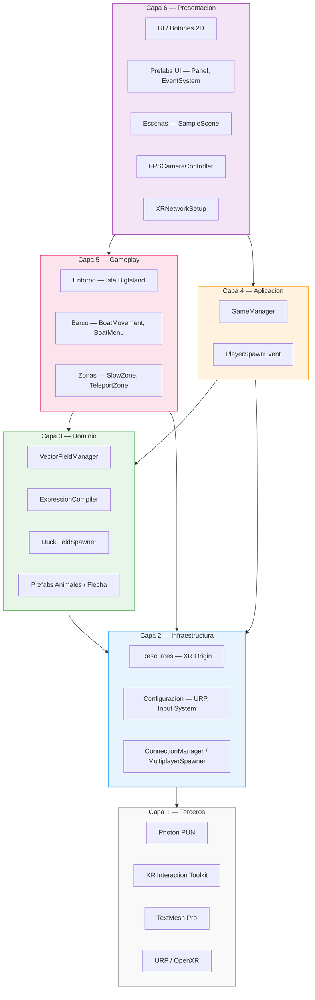
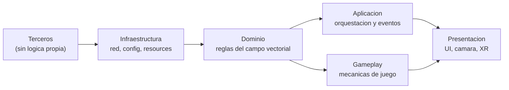
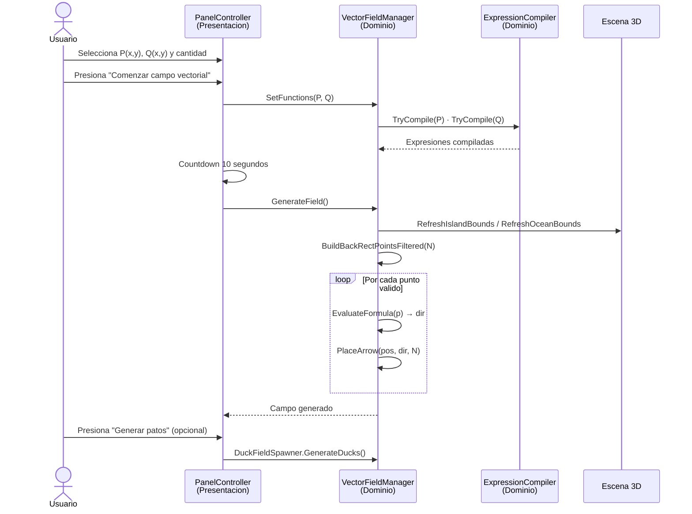
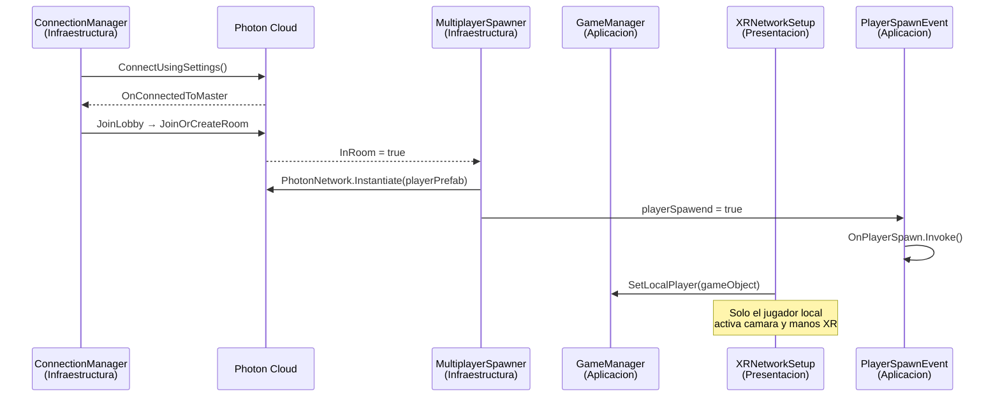
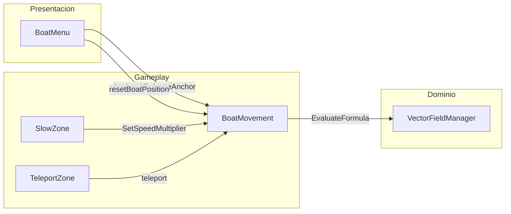
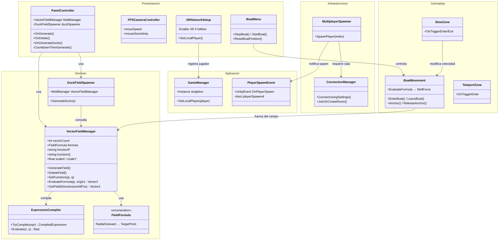
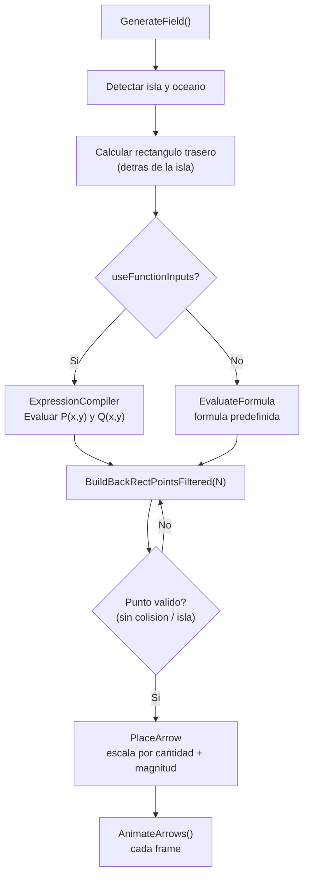

# Aplicacion Vectores

Aplicacion interactiva de **visualizacion de campos vectoriales en 3D** desarrollada en Unity con soporte para **Realidad Virtual (XR)**, **multijugador (Photon)** y modo escritorio FPS. El campo se genera sobre el oceano de una isla 3D, con deteccion automatica del terreno, exclusion de zona de isla y control en tiempo real desde un panel World Space.

---

## Indice

- [Descripcion](#descripcion)
- [Arquitectura en capas](#arquitectura-en-capas)
- [Estructura del proyecto](#estructura-del-proyecto)
- [Mapa de scripts por capa](#mapa-de-scripts-por-capa)
- [Flujo de ejecucion](#flujo-de-ejecucion)
- [Componentes principales](#componentes-principales)
- [Campos vectoriales](#campos-vectoriales)
- [Multijugador y gameplay](#multijugador-y-gameplay)
- [Controles](#controles)
- [Instalacion](#instalacion)
- [Tecnologias](#tecnologias)

---

## Descripcion

La aplicacion genera y anima campos vectoriales sobre la superficie del agua de una isla 3D. El usuario puede explorar la escena en primera persona (escritorio) o en realidad virtual, e interactuar con un panel de control World Space para:

- Definir funciones **P(x,y)** y **Q(x,y)** (estilo James Stewart) o usar formulas predefinidas
- Ajustar la **cantidad de vectores** (100 a 2000)
- Generar, eliminar y observar el campo con **temporizador de 10 segundos**
- Generar **patos** que siguen el campo vectorial
- Jugar en **multijugador** con Photon PUN y XR
- Moverse en **barco** afectado por el campo vectorial

El sistema detecta automaticamente los bounds de la isla y del oceano para distribuir los vectores solo sobre el agua, evitando superposicion con el terreno.

---

## Arquitectura en capas

Todo el contenido del proyecto vive bajo `Assets/Arquitectura/`, organizado por responsabilidades. Las capas superiores dependen de las inferiores, nunca al reves.

### Vista general de capas



### Reglas de dependencia



| Regla | Descripcion |
|-------|-------------|
| **Dominio puro** | `VectorFieldManager` y `ExpressionCompiler` no conocen UI ni Photon |
| **Presentacion delgada** | `PanelController` delega la logica al dominio via `VectorFieldManager` |
| **Infraestructura aislada** | Conexion Photon y spawn de jugadores viven en su propia capa |
| **Terceros intocable** | Librerias externas en `Terceros/` — no mezclar codigo propio ahi |
| **Resources** | La carpeta `Resources/` debe conservar ese nombre (requerido por Unity/Photon) |

---

## Estructura del proyecto

```mermaid
graph TD
    ROOT["AplicacionVectores/"]
    ROOT --> ASSETS["Assets/"]
    ROOT --> PKG["Packages/"]
    ROOT --> PS["ProjectSettings/"]

    ASSETS --> ARCH["Arquitectura/"]

    ARCH --> TER["Terceros/"]
    ARCH --> INF["Infraestructura/"]
    ARCH --> DOM["Dominio/"]
    ARCH --> APP["Scripts/Aplicacion/"]
    ARCH --> GP["Gameplay/"]
    ARCH --> PRE["Presentacion/"]
    ARCH --> SCR["Scripts/"]
    ARCH --> ED["Editor/"]
    ARCH --> REC["Recursos/"]

    TER --> T1["Photon/"]
    TER --> T2["XR / XRI / Samples/"]
    TER --> T3["TextMesh Pro/"]
    TER --> T4["WaterRippleShader/"]

    INF --> I1["Resources/ — XR Origin"]
    INF --> I2["Configuracion/ — URP, InputSystem"]

    DOM --> D1["Animales/ — prefabs 3D"]
    DOM --> D2["CampoVectorial/Flecha/"]

    GP --> G1["Entorno/ — RPG Tiny Fantasy Forest PBR"]
    GP --> G2["Prefabs/ — Boat"]

    PRE --> P1["UI/ — botones 2D, fuentes"]
    PRE --> P2["Prefabs/ — Panel, EventSystem"]
    PRE --> P3["Escenas/ — SampleScene"]

    SCR --> S1["Dominio/"]
    SCR --> S2["Aplicacion/"]
    SCR --> S3["Presentacion/"]
    SCR --> S4["Infraestructura/"]
    SCR --> S5["Gameplay/"]

    ED --> E1["PanelUISetup.cs"]
    ED --> E2["PlayModeStartSceneSetter.cs"]
    ED --> E3["ArrowPrefabGenerator.cs"]
```



### Arbol de carpetas (resumido)

```
Assets/
└── Arquitectura/
    ├── Terceros/                         # Librerias externas
    │   ├── Photon/
    │   ├── TextMesh Pro/
    │   ├── Samples/                      # XR Interaction Toolkit
    │   ├── XR/  ·  XRI/
    │   └── WaterRippleShader Eldvmo/
    │
    ├── Infraestructura/                  # Servicios tecnicos
    │   ├── Configuracion/
    │   │   ├── Settings/                 # URP, render pipeline
    │   │   └── InputSystem_Actions.inputactions
    │   └── Resources/                    # XR Origin (Photon)
    │
    ├── Dominio/                          # Logica de negocio
    │   ├── Animales/                     # Patos, gatos, ovejas…
    │   └── CampoVectorial/
    │       └── Flecha/                   # Prefab de flecha
    │
    ├── Presentacion/                     # UI y escenas
    │   ├── UI/                           # Botones Calculandia, fuentes
    │   ├── Prefabs/                      # Panel, EventSystem, Main Camera
    │   └── Escenas/                      # SampleScene
    │
    ├── Gameplay/                         # Mundo y mecanicas
    │   ├── Entorno/
    │   │   └── RPG Tiny Fantasy Forest PBR/   # BigIsland.unity
    │   └── Prefabs/                      # Boat
    │
    ├── Recursos/
    │   └── Materiales/
    │
    ├── Scripts/                          # Codigo C# por capa
    │   ├── Dominio/
    │   ├── Aplicacion/
    │   ├── Presentacion/
    │   ├── Infraestructura/
    │   └── Gameplay/
    │
    └── Editor/                           # Herramientas del editor Unity
```

---

## Mapa de scripts por capa

| Capa | Script | Responsabilidad |
|------|--------|-----------------|
| **Dominio** | `VectorFieldManager.cs` | Generacion, evaluacion y animacion del campo |
| **Dominio** | `ExpressionCompiler.cs` | Compilacion de expresiones P(x,y) y Q(x,y) |
| **Dominio** | `DuckFieldSpawner.cs` | Spawn y movimiento de patos segun el campo |
| **Aplicacion** | `GameManager.cs` | Singleton de estado global del juego |
| **Aplicacion** | `PlayerSpawnEvent.cs` | Evento Unity al completar el spawn del jugador |
| **Presentacion** | `PanelController.cs` | Panel World Space, timer, botones de campo |
| **Presentacion** | `FPSCameraController.cs` | Camara FPS para modo escritorio |
| **Presentacion** | `XRNetworkSetup.cs` | Habilita XR solo para el jugador local en red |
| **Presentacion** | `BoatMenu.cs` | UI del barco (anclar, reiniciar posicion) |
| **Infraestructura** | `ConnectionManager.cs` | Conexion y lobby Photon |
| **Infraestructura** | `MultiplayerSpawner.cs` | Instancia el jugador en la sala |
| **Gameplay** | `BoatMovement.cs` | Movimiento del barco afectado por el campo |
| **Gameplay** | `SlowZone.cs` | Zona que reduce velocidad del barco |
| **Gameplay** | `TeleportZone.cs` | Teletransporte aleatorio al entrar en zona |

---

## Flujo de ejecucion

### Generacion del campo vectorial (modo Stewart)



### Multijugador



### Interaccion barco ↔ campo vectorial



---

## Componentes principales

### Diagrama de clases (capas)



---

## Campos vectoriales

### Formulas predefinidas

| # | Nombre | Formula | Descripcion |
|---|--------|---------|-------------|
| 0 | **Radial Saliente** | F = (x·sX, y·sY) | Vectores apuntan hacia afuera del origen |
| 1 | **Radial Entrante** | F = (-x·sX, -y·sY) | Vectores convergen hacia el origen |
| 2 | **Rotacion XY** | F = (-y·sX, x·sY) | Campo rotacional puro |
| 3 | **Gravitacional** | F = -r/\|r\|² | Campo tipo gravitacional / electrico |
| 4 | **Silla** | F = (x·sX, -y·sY) | Punto de silla hiperbolico |
| 5 | **Constante** | F = (1·sX, 0) | Flujo uniforme |
| 6 | **Torbellino** | F = (-y, x)/\|r\|² | Rotacion con singularidad en el origen |
| 7 | **Espiral** | F = (x-y, x+y) | Expansion + rotacion |

### Modo Stewart — funciones personalizadas

El panel permite ingresar **P(x,y)** y **Q(x,y)** mediante dropdowns de ejes. `ExpressionCompiler` soporta:

- Operadores: `+ - * / ^`
- Variables: `x`, `y`
- Constantes: `pi`, `e`
- Funciones: `sin`, `cos`, `tan`, `sqrt`, `abs`, `exp`, `ln`, `log`, `log10`

El vector resultante es **F(x,y) = ⟨P(x,y), Q(x,y)⟩** y la longitud de cada flecha es proporcional a |F| (estilo diagramas de Stewart).

### Pipeline de generacion



---

## Multijugador y gameplay

| Feature | Capa | Componente |
|---------|------|--------------|
| Conexion Photon | Infraestructura | `ConnectionManager` |
| Spawn de jugador XR | Infraestructura | `MultiplayerSpawner` |
| Estado global | Aplicacion | `GameManager` |
| XR solo local | Presentacion | `XRNetworkSetup` |
| Movimiento en barco | Gameplay | `BoatMovement` |
| Menu del barco | Presentacion | `BoatMenu` |
| Zona de lentitud | Gameplay | `SlowZone` |
| Zona de teletransporte | Gameplay | `TeleportZone` |

---

## Controles

### Modo Escritorio (FPS)

| Tecla / Accion | Funcion |
|----------------|---------|
| `W A S D` / Flechas | Mover la camara |
| `Click Derecho` + Raton | Rotar la vista |
| `E` / `Espacio` | Subir |
| `Q` / `Ctrl Izq` | Bajar |
| `Shift` | Sprint (velocidad x2.5) |
| `Scroll` (fuera del panel) | Subir / bajar camara |
| `Click Izquierdo` | Interactuar con el panel |

### Modo VR (XR)

| Accion | Funcion |
|--------|---------|
| Movimiento fisico | Desplazamiento en la escena |
| Controlador Ray | Apuntar e interactuar con el panel |
| Trigger | Seleccionar opciones del panel |

### Panel de control

| Control | Descripcion |
|---------|-------------|
| **Cantidad** | Dropdown: 100 a 2000 vectores (paso 100) |
| **Primera funcion f(x,y)** | Dropdown P(x,y): X, -X, -Y, Y, -X-Y, Y² |
| **Segunda funcion f(x,y)** | Dropdown Q(x,y): Y, -Y, X, -X, X-Y, 0 |
| **Comenzar campo vectorial** | Inicia countdown de 10 s y genera el campo |
| **Eliminar campo vectorial** | Borra todas las flechas |
| **Generar patos** | Spawnea patos que siguen el campo (tras 5 s) |

---

## Instalacion

### Requisitos

- **Unity 6** (6000.2.x) o Unity 2022 LTS
- **XR Interaction Toolkit 3.2.2**
- **Photon PUN 2**
- **TextMesh Pro** y **URP**
- Dispositivo VR opcional (OpenXR): Meta Quest, etc.

### Pasos

1. Clonar el repositorio:
   ```bash
   git clone https://github.com/BurbanoValentina/AplicacionVectores.git
   cd AplicacionVectores
   git checkout dev
   ```
2. Abrir el proyecto en **Unity Hub**.
3. Al presionar Play, el editor carga automaticamente `BigIsland.unity` (`PlayModeStartSceneSetter`).
4. Escena principal (manual):
   ```
   Assets/Arquitectura/Gameplay/Entorno/RPG Tiny Fantasy Forest PBR/Scene/BigIsland.unity
   ```
5. Para VR: **Edit → Project Settings → XR Plug-in Management → OpenXR**.

---

## Tecnologias

| Tecnologia | Version | Capa | Uso |
|------------|---------|------|-----|
| **Unity** | 6 LTS | — | Motor de juego |
| **C#** | 9.0 | Scripts/ | Logica de la aplicacion |
| **Photon PUN** | 2.x | Terceros | Multijugador en red |
| **XR Interaction Toolkit** | 3.2.2 | Terceros | Realidad virtual |
| **TextMesh Pro** | — | Terceros | UI de texto |
| **URP** | — | Infraestructura | Render pipeline |
| **OpenXR** | — | Terceros | Compatibilidad VR |
| **RPG Tiny Fantasy Forest PBR** | — | Gameplay/Entorno | Isla y oceano 3D |

---

*Ultima actualizacion: mayo 2026 — arquitectura en capas bajo `Assets/Arquitectura/`*
