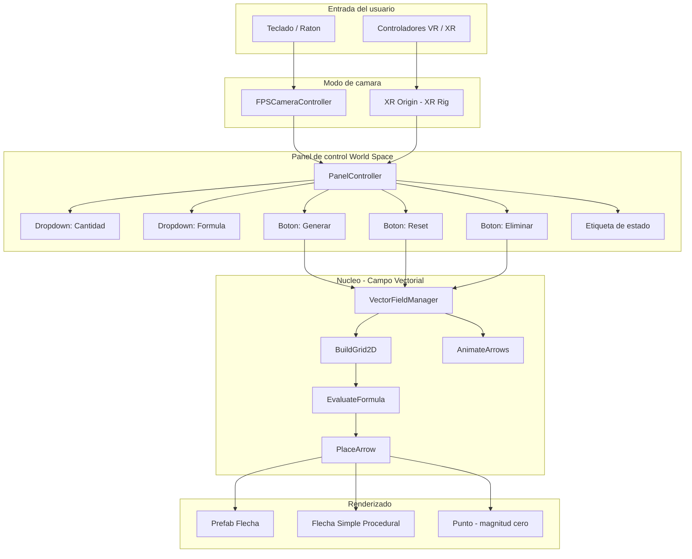
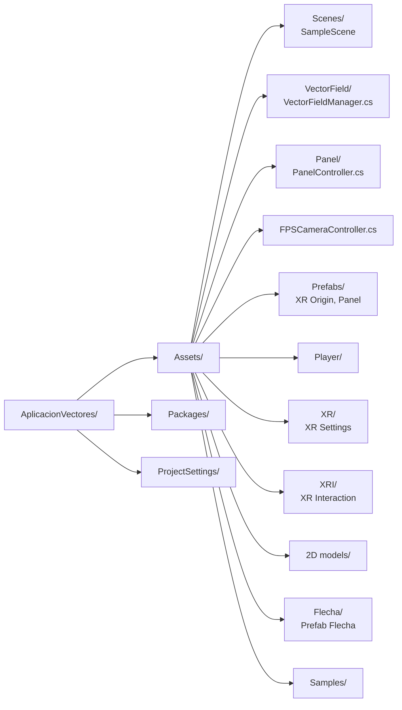
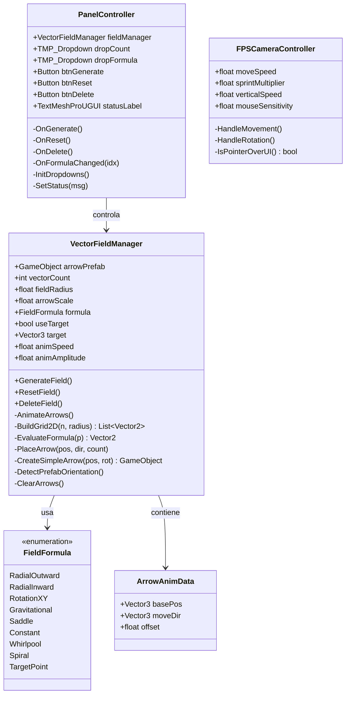
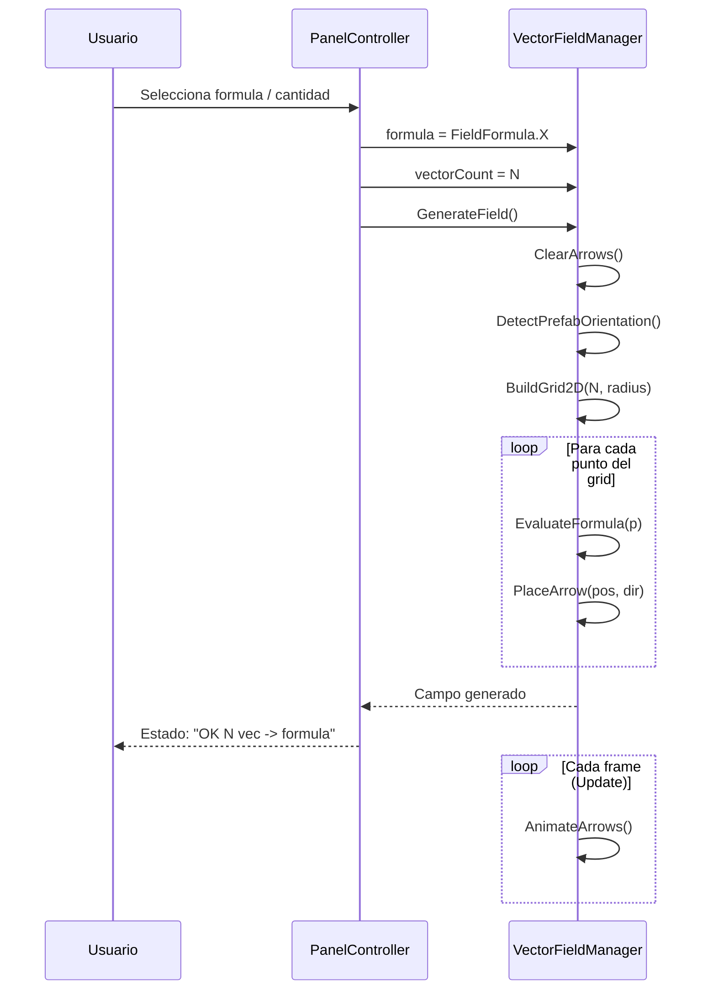

## Cambios por revisar

### Movimiento del barco

| Archivo | Ubicacion | Descripcion |
|---------|-----------|-------------|
| `BoatControl.cs` | `Assets/WaterRippleShader Eldvmo/Scripts/BoatControl.cs` | Movimiento del barco con teclado (W/S avanzar, A/D girar), velocidad, velocidad de rotacion e inclinacion visual (roll/pitch) al moverse |
| `BoatFloatControl.cs` | `Assets/WaterRippleShader Eldvmo/Scripts/BoatFloatControl.cs` | Flotacion del barco sobre el agua usando raycasts al plano de agua y efecto de ondas (ripple) |

### Cambios en el panel de control

| Archivo | Ubicacion | Descripcion |
|---------|-----------|-------------|
| `PanelController.cs` | `Assets/Panel/PanelController.cs` | Se eliminaron las zonas: Agua Norte/Sur/Este/Oeste y Cuadrantes NE/NO/SE/SO. Solo quedan las 6 zonas de Atras y Todo el oceano |
| `PanelController.cs` | `Assets/Panel/PanelController.cs` | Se elimino el texto de estado del panel (statusLabel y descripcion) para que el titulo CAMPO VECTORIAL aparezca en la parte superior |
| `PanelUISetup.cs` | `Assets/Editor/PanelUISetup.cs` | Se ocultan el statusLabel y el descriptionLabel en el layout del prefab |

---

# Aplicacion Vectores

Aplicacion interactiva de **visualizacion de campos vectoriales** en 3D desarrollada en Unity con soporte para **Realidad Virtual (XR)** y modo escritorio FPS.

---

## Indice

- [Descripcion](#descripcion)
- [Arquitectura](#arquitectura)
- [Estructura del Proyecto](#estructura-del-proyecto)
- [Componentes Principales](#componentes-principales)
- [Campos Vectoriales](#campos-vectoriales)
- [Controles](#controles)
- [Instalacion](#instalacion)
- [Tecnologias](#tecnologias)

---

## Descripcion

La aplicacion genera y anima campos vectoriales en un plano 2D proyectado en el espacio 3D. El usuario puede explorar la escena en primera persona (escritorio) o en realidad virtual, e interactuar con un panel de control para cambiar la formula del campo, la cantidad de vectores y otras opciones en tiempo real.

---

## Arquitectura



---

## Estructura del Proyecto



---

## Componentes Principales

### Diagrama de clases



---

## Campos Vectoriales

La aplicacion incluye **9 formulas** de campos vectoriales visualizables:

| # | Nombre | Formula | Descripcion |
|---|--------|---------|-------------|
| 0 | **Radial Saliente** | F = (x, y) | Vectores apuntan hacia afuera del origen |
| 1 | **Radial Entrante** | F = (-x, -y) | Vectores convergen hacia el origen |
| 2 | **Rotacion XY** | F = (-y, x) | Campo rotacional puro (sin divergencia) |
| 3 | **Gravitacional** | F = -r / \|r\|² | Simula campo gravitacional / electrico |
| 4 | **Silla** | F = (x, -y) | Campo hiperbolico tipo punto de silla |
| 5 | **Constante** | F = (1, 0) | Flujo uniforme en una direccion |
| 6 | **Torbellino** | F = (-y, x) / \|r\|² | Rotacion con singularidad en el origen |
| 7 | **Espiral** | F = (x-y, x+y) | Combinacion de expansion y rotacion |
| 8 | **Punto Objetivo** | F = (T - p) / \|T - p\| | Vectores apuntan hacia un punto dado |

### Ciclo de generacion del campo



---

## Controles

### Modo Escritorio (FPS)

| Tecla / Accion | Funcion |
|----------------|---------|
| `W A S D` / Flechas | Mover la camara |
| `Click Derecho` + Raton | Rotar la vista |
| `E` / `Espacio` | Subir |
| `Q` / `Ctrl Izq` | Bajar |
| `Shift` | Sprint (velocidad x2.5) |
| `Scroll` (fuera del panel) | Subir / bajar camara |
| `Click Izquierdo` | Interactuar con el panel |

### Modo VR (XR)

| Accion | Funcion |
|--------|---------|
| Movimiento fisico | Desplazamiento en la escena |
| Controlador Ray | Apuntar e interactuar con el panel |
| Trigger | Seleccionar opciones del panel |

### Panel de Control

| Control | Opciones |
|---------|---------|
| Dropdown Cantidad | 100 a 2000 vectores (paso de 100) |
| Dropdown Formula | 8 formulas predefinidas |
| Boton Generar | Genera el campo con la configuracion actual |
| Boton Reset | Reinicia a configuracion por defecto (Radial Out, 100) |
| Boton Eliminar | Elimina todos los vectores de la escena |

---

## Instalacion

### Requisitos

- **Unity 6** (recomendado) o Unity 2022 LTS
- **XR Interaction Toolkit** (incluido en Packages)
- **TextMesh Pro** (incluido en Assets)
- Dispositivo VR opcional (compatible con OpenXR): Meta Quest, HTC Vive, etc.

### Pasos

1. Clonar o descargar el repositorio:
   ```bash
   git clone https://github.com/BurbanoValentina/AplicacionVectores.git
   ```
2. Abrir Unity Hub y seleccionar **Open Project**.
3. Navegar hasta la carpeta `AplicacionVectores/` y confirmar.
4. En Unity, abrir la escena principal:
   ```
   Assets/Scenes/SampleScene.unity
   ```
5. Presionar **Play** para ejecutar en modo escritorio.
6. Para VR, configurar el dispositivo en **Edit > Project Settings > XR Plug-in Management**.

---

## Tecnologias

| Tecnologia | Uso |
|------------|-----|
| **Unity** | Motor de juego y renderizado |
| **C#** | Logica de la aplicacion |
| **XR Interaction Toolkit** | Soporte para realidad virtual |
| **TextMesh Pro** | UI de texto de alta calidad |
| **Universal Render Pipeline (URP)** | Pipeline de renderizado |
| **OpenXR** | Compatibilidad con multiples dispositivos VR |
| **ProBuilder** | Modelado de la flecha 3D |

---

