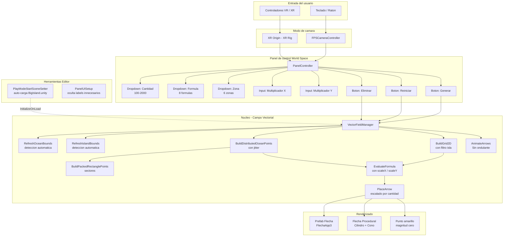
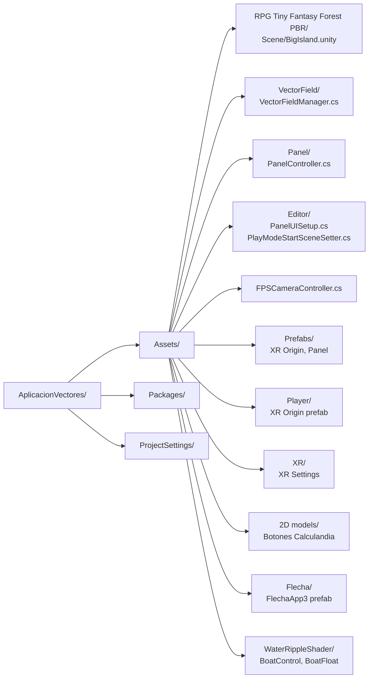
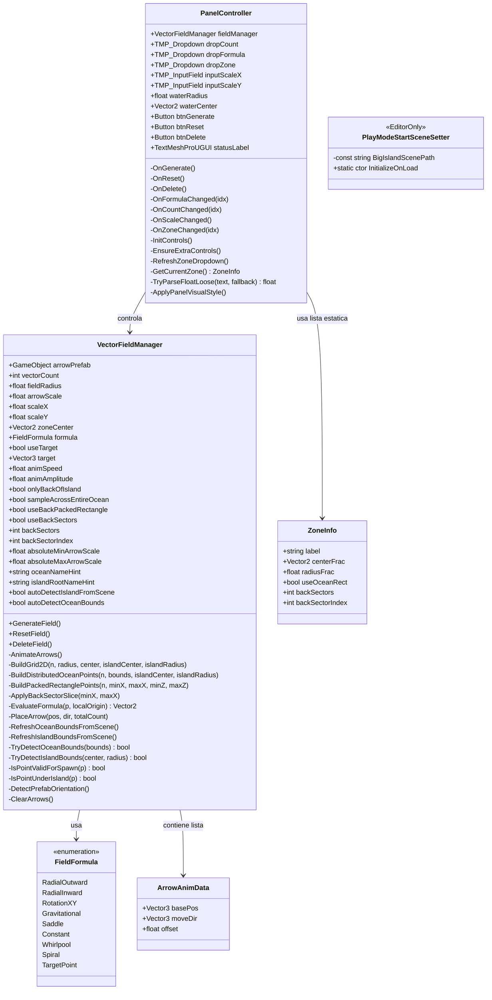
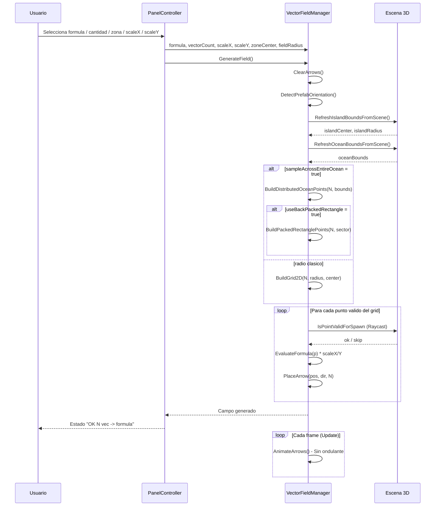
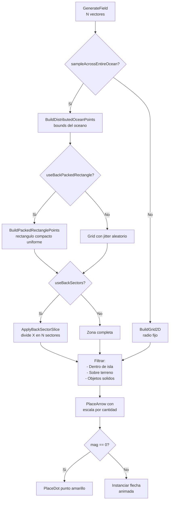

# Aplicacion Vectores

Aplicacion interactiva de **visualizacion de campos vectoriales en 3D** desarrollada en Unity con soporte para **Realidad Virtual (XR)** y modo escritorio FPS. El campo se genera sobre el oceano de una isla 3D, con deteccion automatica del terreno, exclusion de zona de isla y control en tiempo real desde un panel World Space.

---

## Indice

- [Descripcion](#descripcion)
- [Arquitectura](#arquitectura)
- [Estructura del Proyecto](#estructura-del-proyecto)
- [Componentes Principales](#componentes-principales)
- [Campos Vectoriales](#campos-vectoriales)
- [Zonas de Visualizacion](#zonas-de-visualizacion)
- [Controles](#controles)
- [Instalacion](#instalacion)
- [Tecnologias](#tecnologias)

---

## Descripcion

La aplicacion genera y anima campos vectoriales sobre la superficie del agua de una isla 3D. El usuario puede explorar la escena en primera persona (escritorio) o en realidad virtual, e interactuar con un panel de control World Space para:

- Cambiar la **formula matematica** del campo vectorial
- Ajustar la **cantidad de vectores** (100 a 2000)
- Aplicar **multiplicadores independientes X e Y** para escalar o invertir el campo
- Seleccionar la **zona de visualizacion** (toda el agua, sectores traseros)
- Generar, reiniciar o eliminar el campo en tiempo real

El sistema detecta automaticamente los bounds de la isla y del oceano para distribuir los vectores solo sobre el agua, evitando superposicion con el terreno.

---

## Arquitectura



---

## Estructura del Proyecto



---

## Componentes Principales

### Diagrama de clases



---

## Campos Vectoriales

La aplicacion incluye **8 formulas** de campos vectoriales visualizables. El resultado de cada formula se multiplica por `scaleX` y `scaleY` antes de colocar la flecha:

| # | Nombre | Formula | Descripcion |
|---|--------|---------|-------------|
| 0 | **Radial Saliente** | F = (x·sX, y·sY) | Vectores apuntan hacia afuera del origen |
| 1 | **Radial Entrante** | F = (-x·sX, -y·sY) | Vectores convergen hacia el origen |
| 2 | **Rotacion XY** | F = (-y·sX, x·sY) | Campo rotacional puro (sin divergencia) |
| 3 | **Gravitacional** | F = -r/\|r\|² | Simula campo gravitacional / electrico |
| 4 | **Silla** | F = (x·sX, -y·sY) | Campo hiperbolico tipo punto de silla |
| 5 | **Constante** | F = (1·sX, 0) | Flujo uniforme en una direccion |
| 6 | **Torbellino** | F = (-y, x)/\|r\|² | Rotacion con singularidad en el origen |
| 7 | **Espiral** | F = (x-y, x+y) | Combinacion de expansion y rotacion |

> El campo **Punto Objetivo** (TargetPoint) existe en el enum pero esta deshabilitado en el panel.

### Ciclo de generacion del campo



---

## Zonas de Visualizacion

El dropdown **Zona** permite concentrar el campo en distintas partes del oceano. Las zonas usan los bounds reales del objeto `Ocean` detectado en escena:

| Zona | Descripcion | Sectores |
|------|-------------|---------|
| **Atras (todo)** | Toda el agua detras de la isla | 1 (completo) |
| **Atras sector 1/4** | Cuarto izquierdo del agua trasera | 4 → idx 0 |
| **Atras sector 2/4** | Segundo cuarto del agua trasera | 4 → idx 1 |
| **Atras sector 3/4** | Tercer cuarto del agua trasera | 4 → idx 2 |
| **Atras sector 4/4** | Cuarto derecho del agua trasera | 4 → idx 3 |
| **Todo el oceano (sin isla)** | Oceano completo excluyendo la isla | 1 (completo) |

### Logica de distribucion



---

## Controles

### Modo Escritorio (FPS)

| Tecla / Accion | Funcion |
|----------------|---------|
| `W A S D` / Flechas | Mover la camara |
| `Click Derecho` + Raton | Rotar la vista |
| `E` / `Espacio` | Subir |
| `Q` / `Ctrl Izq` | Bajar |
| `Shift` | Sprint (velocidad x2.5) |
| `Scroll` (fuera del panel) | Subir / bajar camara |
| `Click Izquierdo` | Interactuar con el panel |

### Modo VR (XR)

| Accion | Funcion |
|--------|---------|
| Movimiento fisico | Desplazamiento en la escena |
| Controlador Ray | Apuntar e interactuar con el panel |
| Trigger | Seleccionar opciones del panel |

### Panel de Control

| Control | Tipo | Opciones / Valores |
|---------|------|--------------------|
| **Cantidad** | Dropdown | 100 a 2000 vectores (paso de 100) |
| **Formula** | Dropdown | 8 formulas predefinidas |
| **Zona** | Dropdown | 6 zonas de visualizacion |
| **Multiplicador X** | Input numerico | Cualquier flotante (default 1). Negativo invierte eje X |
| **Multiplicador Y** | Input numerico | Cualquier flotante (default 1). Negativo invierte eje Y |
| **Generar Campo Vectorial** | Boton verde | Genera con la configuracion actual |
| **Reiniciar Campo** | Boton naranja | Vuelve a Radial Out, 100 vec, scaleX/Y=1, zona default |
| **Eliminar Campo Vectorial** | Boton rojo | Elimina todos los vectores de la escena |

> Cambiar el dropdown de **Formula** o **Zona** regenera el campo automaticamente sin necesidad de presionar Generar.

---

## Instalacion

### Requisitos

- **Unity 6** (recomendado) o Unity 2022 LTS
- **XR Interaction Toolkit 3.2.2** (incluido en Packages)
- **TextMesh Pro** (incluido en Assets)
- Dispositivo VR opcional (compatible con OpenXR): Meta Quest, HTC Vive, etc.

### Pasos

1. Clonar el repositorio:
   ```bash
   git clone https://github.com/BurbanoValentina/AplicacionVectores.git
   ```
2. Abrir Unity Hub y seleccionar **Open Project**, navegar a `AplicacionVectores/`.
3. Al abrir Unity, el editor cargara automaticamente la escena `BigIsland.unity` al presionar Play (via `PlayModeStartSceneSetter`).
4. Para abrir manualmente la escena principal:
   ```
   Assets/RPG Tiny Fantasy Forest PBR/Scene/BigIsland.unity
   ```
5. Presionar **Play** para ejecutar en modo escritorio.
6. Para VR, configurar el dispositivo en **Edit > Project Settings > XR Plug-in Management**.

---

## Tecnologias

| Tecnologia | Version | Uso |
|------------|---------|-----|
| **Unity** | 6 LTS | Motor de juego y renderizado |
| **C#** | 9.0 | Logica de la aplicacion |
| **XR Interaction Toolkit** | 3.2.2 | Soporte para realidad virtual |
| **TextMesh Pro** | - | UI de texto de alta calidad |
| **Universal Render Pipeline (URP)** | - | Pipeline de renderizado |
| **OpenXR** | - | Compatibilidad con multiples dispositivos VR |
| **ProBuilder** | - | Modelado de la flecha 3D (FlechaApp3) |
| **RPG Tiny Fantasy Forest PBR** | - | Escena de isla con oceano |

---

*Ultima actualizacion: abril 2026*
